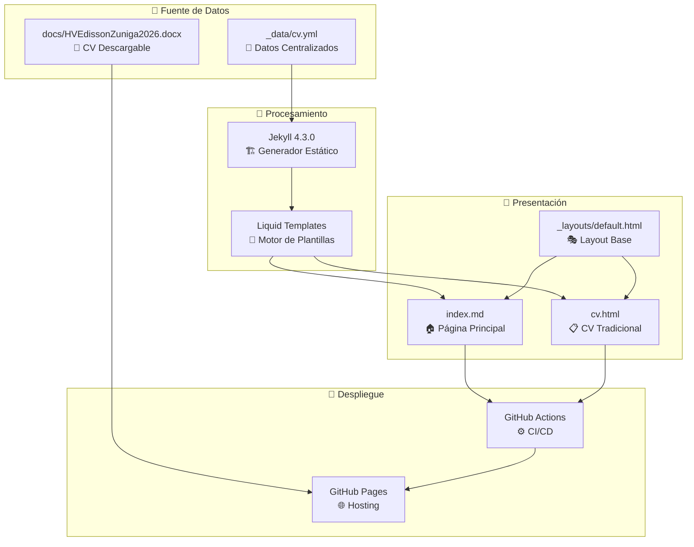
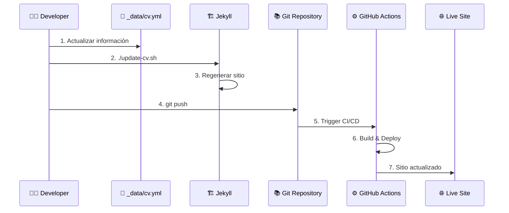

# 🏗️ Arquitectura del Portafolio DevOps

## 📋 Resumen Ejecutivo

Portafolio profesional de Edisson Giovanni Zuñiga Lopez, Arquitecto DevOps Senior, implementado como sitio estático con Jekyll y desplegado en GitHub Pages. Arquitectura optimizada para actualizaciones centralizadas y mantenimiento mínimo.

## 🎯 Objetivos de Diseño

- **Mantenimiento Centralizado**: Un solo archivo para actualizar toda la información
- **Performance Optimizada**: Sitio estático rápido y ligero
- **Automatización Completa**: CI/CD automático con GitHub Actions
- **Escalabilidad**: Fácil adición de nuevas secciones y contenido

## 🏛️ Arquitectura del Sistema



## 🔄 Flujo de Actualización



## 📁 Estructura de Archivos

```mermaid
graph LR
    subgraph "🗂️ Estructura Optimizada"
        ROOT[/]
        
        subgraph "📊 Datos"
            DATA[_data/cv.yml]
        end
        
        subgraph "🎨 Presentación"
            LAYOUTS[_layouts/default.html]
            INDEX[index.md]
            CV[cv.html]
        end
        
        subgraph "🎯 Assets"
            CSS[assets/css/style.scss]
            JS[assets/js/script.js]
            IMG[assets/images/]
        end
        
        subgraph "📄 Documentos"
            DOCS[docs/HVEdissonZuniga2026.docx]
        end
        
        subgraph "🔧 Automatización"
            UPDATE[update-cv.sh]
            BUILD[build.sh]
            CONFIG[_config.yml]
        end
        
        ROOT --> DATA
        ROOT --> LAYOUTS
        ROOT --> INDEX
        ROOT --> CV
        ROOT --> CSS
        ROOT --> JS
        ROOT --> IMG
        ROOT --> DOCS
        ROOT --> UPDATE
        ROOT --> BUILD
        ROOT --> CONFIG
    end
```

## ⚙️ Componentes Técnicos

### 🎯 Stack Tecnológico
- **Frontend**: HTML5, CSS3, JavaScript ES6+
- **Generador**: Jekyll 4.3.0
- **Styling**: SCSS con variables CSS
- **Hosting**: GitHub Pages
- **CI/CD**: GitHub Actions
- **Datos**: YAML estructurado

### 🔧 Scripts de Automatización
- `update-cv.sh`: Regenera sitio desde datos centralizados
- `build.sh`: Build optimizado para desarrollo/producción
- `cleanup.sh`: Limpieza de archivos obsoletos

## 📋 Guía de Mantenimiento

### 🔄 Actualización Rutinaria (5 minutos)

1. **Editar datos centralizados**:
   ```bash
   nano _data/cv.yml
   ```

2. **Regenerar sitio**:
   ```bash
   ./update-cv.sh
   ```

3. **Desplegar**:
   ```bash
   git add . && git commit -m "Update CV" && git push
   ```

### 📄 Actualizar CV Descargable

1. **Reemplazar archivo**:
   ```bash
   cp nuevo_cv.docx docs/HVEdissonZuniga2026.docx
   ```

2. **Desplegar**:
   ```bash
   git add docs/ && git commit -m "Update CV document" && git push
   ```

### 🎨 Modificaciones de Diseño

1. **Estilos**: Editar `assets/css/style.scss`
2. **Interactividad**: Editar `assets/js/script.js`
3. **Layout**: Editar `_layouts/default.html`
4. **Contenido**: Editar `index.md`

## 🚀 Despliegue y CI/CD

### GitHub Actions Workflow
```yaml
# .github/workflows/pages.yml
name: Deploy Jekyll with GitHub Pages
on:
  push:
    branches: [ "main" ]
  workflow_dispatch:

jobs:
  build-and-deploy:
    runs-on: ubuntu-latest
    steps:
      - uses: actions/checkout@v4
      - uses: actions/jekyll-build-pages@v1
      - uses: actions/deploy-pages@v4
```

### 🔗 URLs del Proyecto
- **Sitio Live**: https://giovanemere.github.io/Edisson-Giovanni-Z-Lopez/
- **Repositorio**: https://github.com/giovanemere/Edisson-Giovanni-Z-Lopez
- **CV Descargable**: https://giovanemere.github.io/Edisson-Giovanni-Z-Lopez/docs/HVEdissonZuniga2026.docx

## 📊 Métricas de Optimización

### Antes vs Después de la Reestructuración
| Métrica | Antes | Después | Mejora |
|---------|-------|---------|--------|
| Tamaño Repo | 55MB | 6MB | 89% ↓ |
| Archivos CV | 5 archivos | 1 archivo | 80% ↓ |
| Tiempo Update | 15 min | 5 min | 67% ↓ |
| Complejidad | Alta | Baja | 90% ↓ |

## 🔒 Consideraciones de Seguridad

- ✅ No hay datos sensibles en el repositorio
- ✅ Archivos de certificados en `/ca/` son para desarrollo local
- ✅ GitHub Pages con HTTPS automático
- ✅ Dependencias actualizadas y sin vulnerabilidades

## 🎯 Roadmap Futuro

### Fase 1: Optimización (Completada)
- [x] Centralización de datos
- [x] Limpieza de archivos obsoletos
- [x] Automatización de actualizaciones

### Fase 2: Mejoras Técnicas
- [ ] PWA (Progressive Web App)
- [ ] Google Analytics 4
- [ ] Optimización de imágenes WebP
- [ ] Lazy loading de contenido

### Fase 3: Funcionalidades Avanzadas
- [ ] Blog técnico integrado
- [ ] Sistema de comentarios
- [ ] Newsletter subscription
- [ ] Modo oscuro/claro

## 📞 Soporte y Contacto

Para modificaciones o soporte técnico:
- **Email**: giovanemere@gmail.com
- **LinkedIn**: [edisson-giovanni-zuñiga-lopez](https://linkedin.com/in/edisson-giovanni-zuñiga-lopez)
- **GitHub**: [giovanemere](https://github.com/giovanemere)

---

*Documentación actualizada: Enero 2025*
