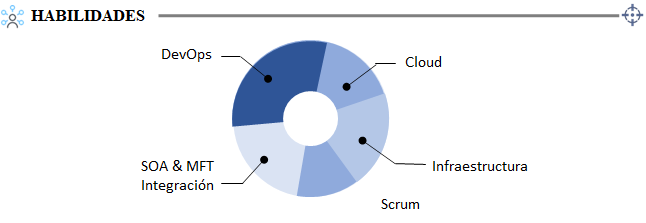
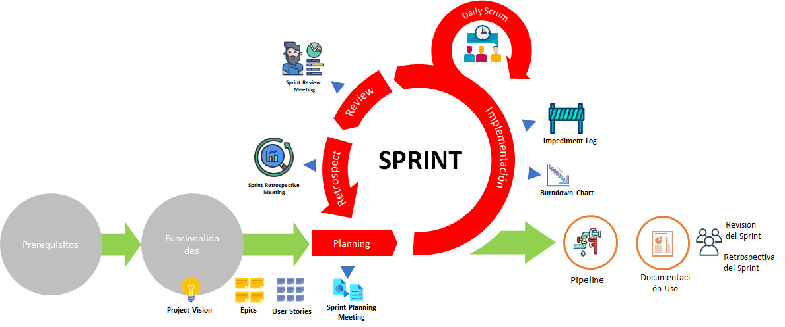
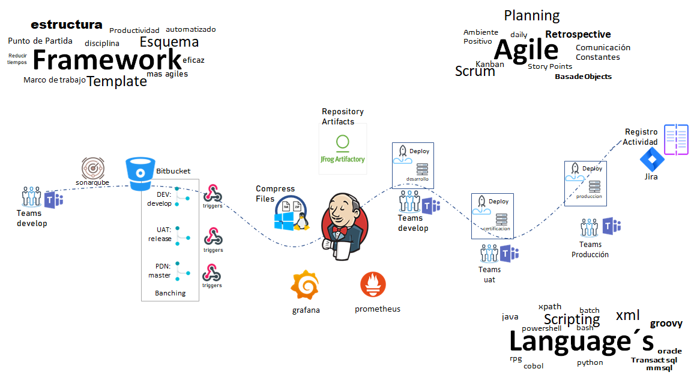
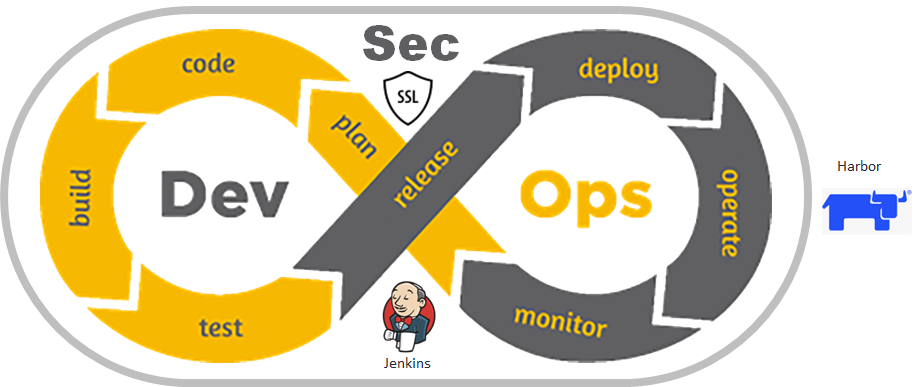

Edisson Giovanni Zuñiga Lopez

Arquitecto DevOps
Propulson MFT Women en AOS
Propulsor Semilleros DevOps Club Adsoft | Banco Popular | AOS

 Perfil 

Profesional Senior con formación especializada en proyectos con mas de 10 años de experiencia,
participando en varios proyectos Tecnologicos del sector bancario entreo otros, que incluyen infraestructura 
en alta Disponibilidad Ompremise, Nube e Hibrida. En los ultimos 7 años enfocado en implementación y Desarrollos
de capacidades en DevOps, Docker, Kubernetes, desarrollos de frameworks con la capacidad de implementar pipeline 
de CI/CD de aplicaciones que se adecuan a la organización y mejorar al equipo de trabajo con entusiasmo, liderazgo
y acoplarnos a las nuevas metodologias de trabajo en equipo.

| *                                              | Información de Contacto                        |
| ---------------------------------------------- | ----------------------------------------------- |
|  | giovanemere@gmail.com                           |
|  | Carrera 4 # 8-62 - Zipaquira                    |
|  | giovanemere.github.io/Edisson-Giovanni-Z-Lopez/ |
|  | edisson-giovanni-zuñiga-lopez                  |
|  | +57 316 526 9803                                |

 Educación

|                                                |                                                                  |                                                |                                                    |                                                |                                                               |
| ---------------------------------------------- | ---------------------------------------------------------------- | ---------------------------------------------- | -------------------------------------------------- | ---------------------------------------------- | ------------------------------------------------------------- |
|  | Tranning Architectura Lambda/Function Cloudformation   |  | TalleresIntegración Continua Cloud Computing |  | Univeridad Cooperativa de Colombia Ingeniero de Sietemas |
|  | Tranning Google [https://goo.su/o3uh6R](https://goo.su/o3uh6R) |                                                | Kubernetes Docker Helm                   |  | Seminario Itil v3, Cobit 5 e ISO 20000:2011                 |
| Itil V3                                        | Fundamentals Certified                                           | Terraform                                      | [https://goo.su/uRPY](https://goo.su/uRPY)            |  | Certified                                                     |

 Experiencia

| Año | Empresa                          | Cargo                                                                                                                                                        |
| ---- | -------------------------------- | ------------------------------------------------------------------------------------------------------------------------------------------------------------ |
| 2022 | Architec DevOps                  | Arquitecto en DevOps, Proyecto Google, Nuevas Integraciones, Suite Atlassion, Sonar, grafana, Prometheus, Colpatria                                          |
| 2021 | Enginnier DevOps                 | Cloud Native Sterling, Kubernetes/Helm Azure, Code Pipeline AWS, Framework, CI/CD Jenkins, CI/CD BUS, CI/CD Sterling, CI/CD Powercenter, Colpatria           |
| 2021 | Consultant Sterling              | Developer e Implementador Pipeline Azure DevOps Sterling Cloud Native Bancolombia, Implementador de Infraestructura AWS y Assesment de Seguridad GBM, Itau   |
| 2019 | Consultant Sterling              | Líder Team Developer Sterling, Migración Arquitectura Proyecto Latam y Migración de Intercambio de Archivos a Sterling Colpatria                          |
| 2016 | Ambientes y Versiones            | Implementador y Configuraction entre Ambientes de Load Balancing F5, Liferay DXP, BPM BizAgi, WAS, Registry, Bus Integration, MQ,. Banco Pichincha           |
| 2015 | I+D                              | Creación de Producto Ambientes y Versiones, Nuevos Proyectos en DevOps, Performance, Agile, Diseño, Ejecución, Implementación Tesnting. Choucair Testing |
| 2013 | Analista de Ambientes de Pruebas | Tunning DB Oracle, Administración , Linux/HP-UX, Automatización, Ambientes QA. Proyecto Claro                                                              |
| 2012 | Microhome Ingeniero  Soporte     | Admin, Windows , Linux, SQL Server, DeveLoper Sistema de Gestión Documental. Solugem y Amezuita Consultores                                                 |
| 2010 | Soporte Appliance                | Mantenimiento, Appliance HP, DELL, Instalación, y Configuración, Server Microsotf, AD, Print Server, Granjas Servidor                                      |

Nos dapatadmos a las nuevas metodologias de trabajao en equipo

Adapatamos Frameworks a las tencnologias soportadas por las compañias

Nos especializamos en aseguramos en implementar las mejores practicas de seguridad en el dato, el canal y la red de forma segura

Siempre trabajamos con el mejor estilo y creatividad

File

| No | Name                                                                                                      |
| -- | --------------------------------------------------------------------------------------------------------- |
| 1  | [ca](https://github.com/giovanemere/CA/blob/65dfb484701608fc752b9c9a73db1ecf7a4b90f7/ca/openssl.cnf)         |
| 2  | [intermedia](https://github.com/giovanemere/CA/blob/65dfb484701608fc752b9c9a73db1ecf7a4b90f7/ca/openssl.cnf) |
