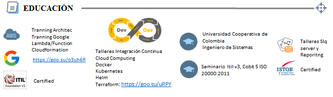
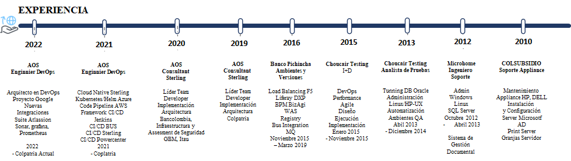

|  | Edisson Giovanni Zuñiga Lopez Ingeniero DevOps |
| ---------------------------------------------- | ---------------------------------------------------- |

Información de Contacto

|                                                |                                                 |
| ---------------------------------------------- | ----------------------------------------------- |
|  | giovanemere@gmail.com                           |
|  | Carrera 4 # 8-62 - Zipaquira                    |
|  | giovanemere.github.io/Edisson-Giovanni-Z-Lopez/ |
|  | edisson-giovanni-zuñiga-lopez                  |
|  | +57 316 526 9803                                |

Perfil

Profesional Senior con formación especializada en proyectos con mas de 10 años de
experiencia, Participación activa en varios proyectos tecnológicos, sector
bancario, que incluyen infraestructura en alta Disponibilidad Onpremise,
Nube e Hibrida, En los últimos 7 años enfocado DevOps, Docker, kubernetes,
desarrollo de Pipeline en la capacidad en crear framework
que se adecuan a cada organización y metodología de trabajo.

